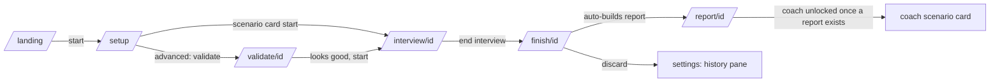
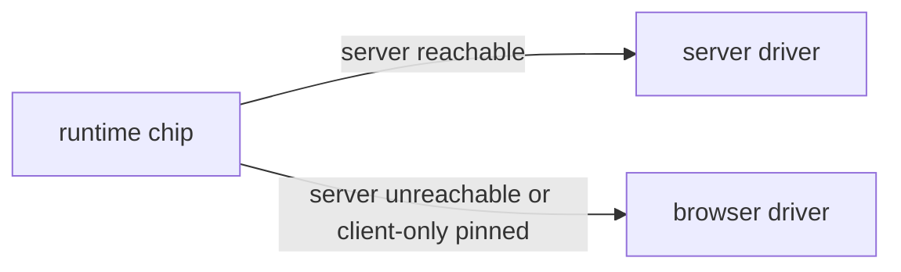

# User flows

Two runtimes share one flow: **server mode** (the `di` Hono server — voice WS

- REST + SQLite) and **client-only mode** (static SPA — OPFS storage, browser
  voice driver, BYO or demo LLM). The capability line: browser mode covers
  everything the sandbox allows; the server adds ingestion, managed providers
  and the voice pipeline on top.

## Main flow (landing -> setup -> interview -> finish -> report)

1. Landing `/`: start -> `/setup`.
2. Setup `/setup`: scenario cards carry the narrative, a 3-goal checklist and
   the toolset chips; each card has its own start CTA that creates the
   session and goes straight to `/interview/[id]` (skips validate, p3).
   Advanced options (collapsed): title, duration, mode `interview|coach`,
   tool toggles, custom prompt, file upload (server mode only — the drop
   zone is replaced by a "needs the server runtime" note in browser mode),
   and an opt-in `/validate/[id]` step.
3. Validate `/validate/[id]` (optional): chat-style plan refinement against
   the agent — left pane questions the user, right pane shows the draft
   interview plan; skip or "looks good, start".
4. Interview `/interview/[id]`: AgentStage (presence orb + state word + live
   caption) on top, sticky ControlBar (mic, mute, type, end) pinned bottom,
   transcript in a rail/bottom-sheet, tools in the registry-driven ToolDock.
   Turns work over voice or text; text turns take the same pipeline in both
   runtimes. Server mode streams PCM over the voice WS (client VAD delimits
   utterances); client-only runs the BrowserVoiceDriver against the
   configured or demo LLM. Kickoff: if nobody speaks first, the agent greets
   after a short delay.
5. Finish `/finish/[id]`: auto-builds the report on mount (server mode POSTs
   `/v1/sessions/:id/report`; client-only generates in-browser against the
   configured LLM) and auto-advances to `/report/[id]`. Failure shows an
   error with try-again, never an infinite spinner. Discard marks the
   session `discarded` and opens the history pane.
6. Report `/report/[id]`: overall score, coverage, per-competency evidence.
   First report existing unlocks coach-mode scenario cards.
7. History is a settings-dialog pane (`?settings=1&pane=history`), not a
   route; sessions can be reopened (report viewer) from it.

## Runtime selection

- The runtime-mode chip (header) shows the effective runtime: `server`,
  `in-browser`, or `server unreachable — using in-browser`.
- A static deploy's health probe 200 on SPA-fallback HTML used to false-
  positive into server mode; the probe now requires the API's real payload
  shape, so static hosts resolve to client-only (p0.4).
- Switching modes persists to `di.runtime-mode` in localStorage and re-probes.

## Error / recovery paths

- **Voice fails to connect / drops**: reconnect with exp backoff (5 tries);
  the error tells the user the transcript is saved and offers retry.
- **Mic denied or VAD/capture fails**: the WS is closed rather than leaving
  a zombie VoiceLoop; the interview continues via the text path ("type").
- **Agent speaks but user hears nothing / voice degrades**: fallback hint
  surfaces the type-instead input immediately.
- **Report generation fails**: finish shows `finish.buildFailed` + try again;
  it never spins forever.
- **Provider config incomplete in settings**: the settings dialog flags the
  incomplete section instead of silently dropping it; in browser mode the
  demo LLM one-click fill covers zero-conf.
- **Back nav mid-interview**: guarded — leaving requires confirming end.

## Where each piece persists

- Server mode: `sessions`/`turns`/`tool_states`/`reports`/`events`/`documents`
  tables in the SQLite db at `files.db_path` (default platform app-support dir).
- Client-only: OPFS mirror under `sessions/[id].json`, `sessions/turns/[id].json`,
  reports and tool state — same shapes via `@di/shared` schemas.
